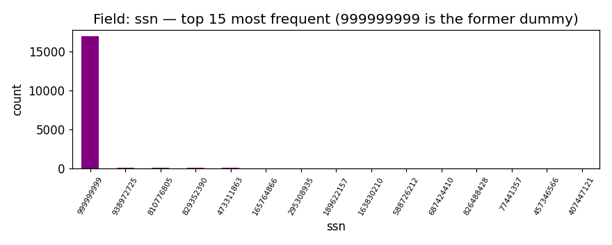
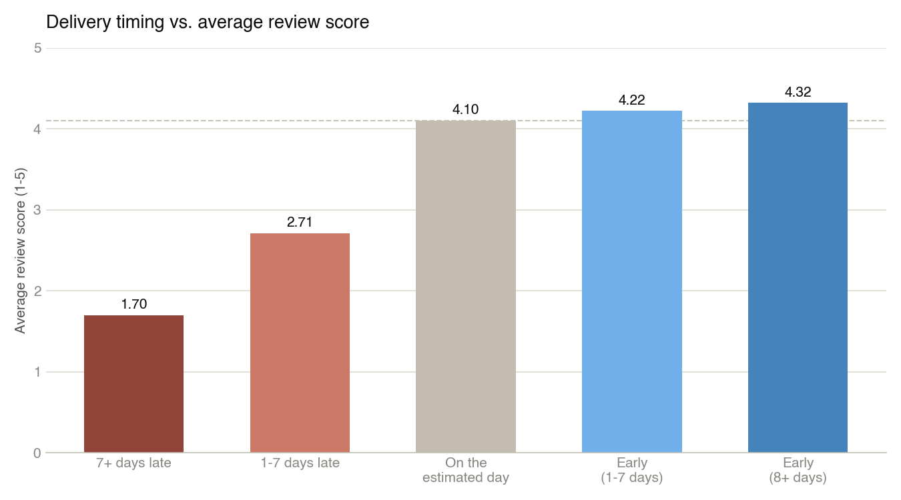
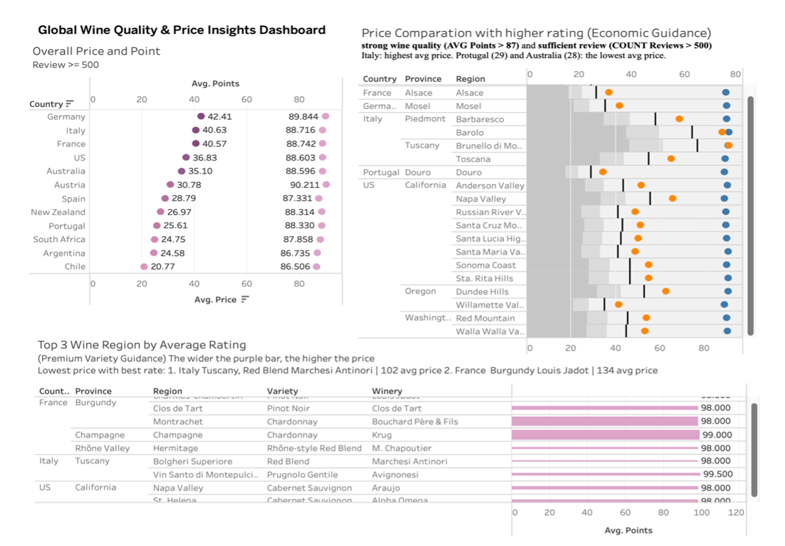
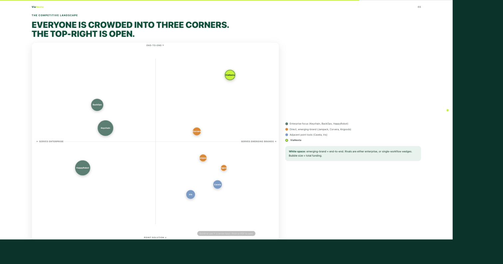
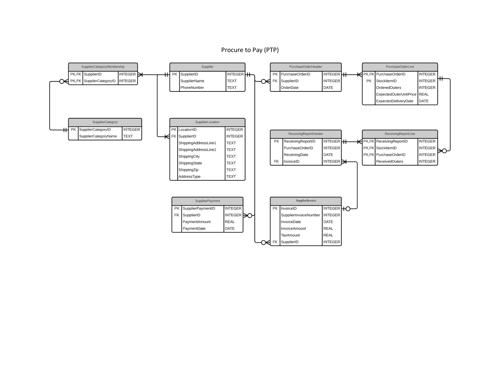
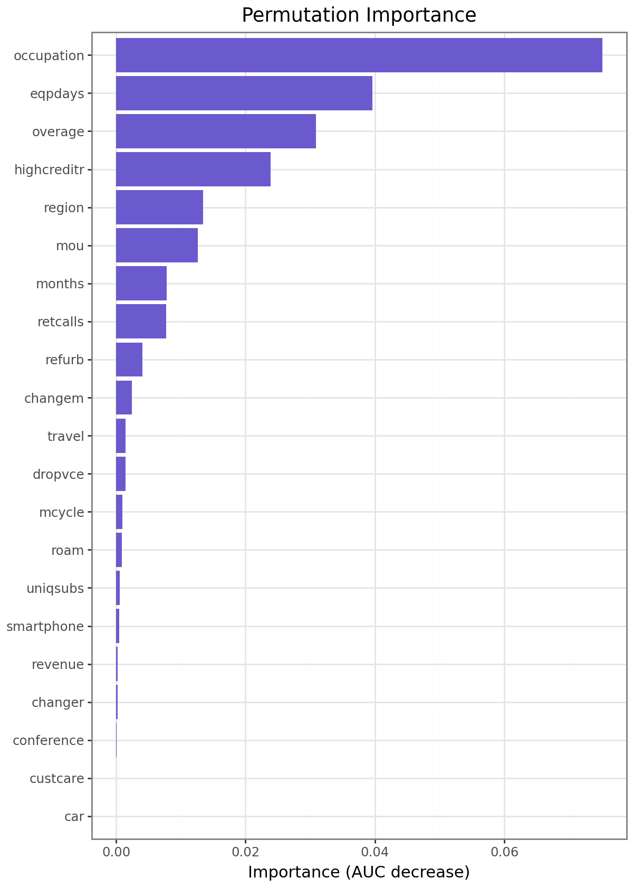
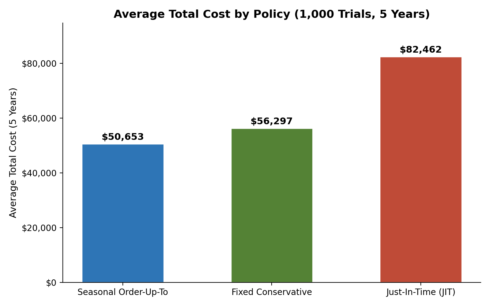
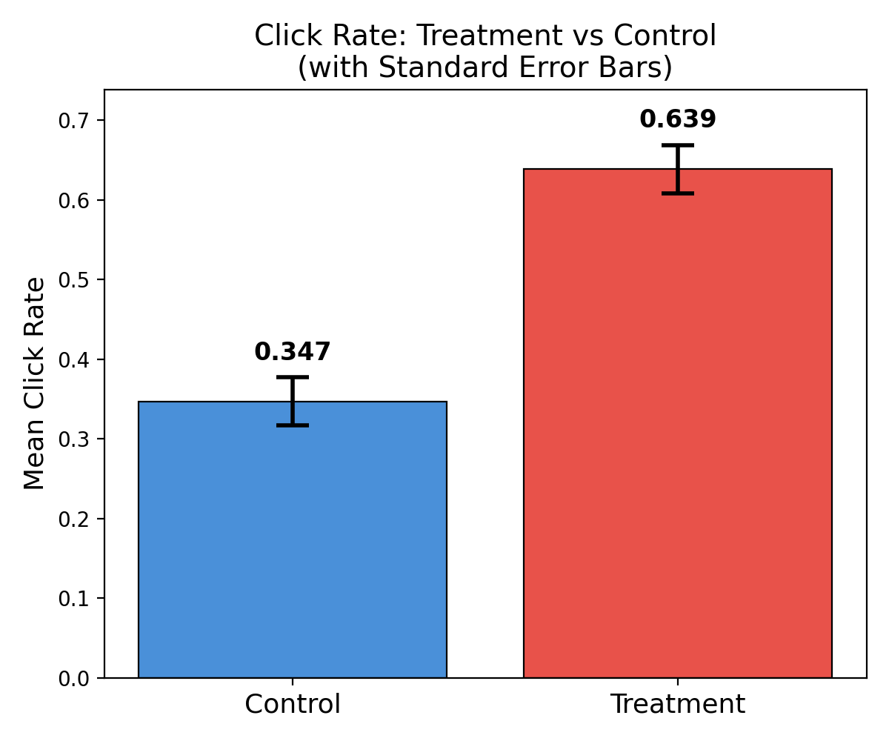
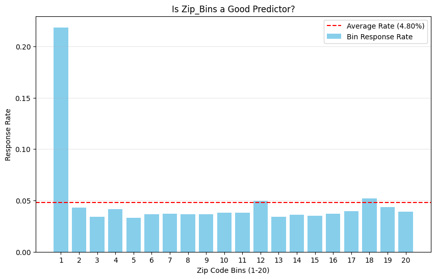
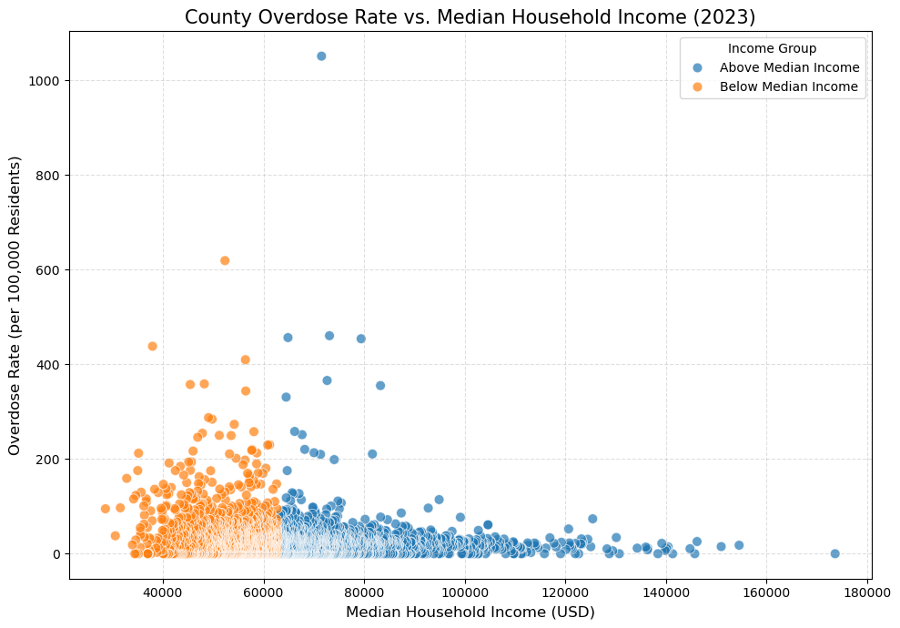

```{=html}
<div id="bg-canvas" aria-hidden="true">
  <div class="aurora-blob blob-1"></div>
  <div class="aurora-blob blob-2"></div>
  <div class="aurora-blob blob-3"></div>
  <div class="aurora-blob blob-4"></div>
</div>
<div class="proj-intro">
  <p>Eleven projects, ordered by the business decision each one actually changes, from the highest-stakes call down. Every chart and diagram below is pulled straight from my own analysis.</p>
</div>

<div class="proj-filters">
  <button class="proj-filter active" data-filter="all">Show all</button>
  <button class="proj-filter" data-filter="bi">Business Intelligence</button>
  <button class="proj-filter" data-filter="sql">SQL &amp; Data Engineering</button>
  <button class="proj-filter" data-filter="ml">Machine Learning</button>
  <button class="proj-filter" data-filter="pm">Product Management</button>
  <button class="proj-filter" data-filter="marketing">Marketing Analytics</button>
  <button class="proj-filter" data-filter="ops">Operations</button>
  <button class="proj-filter" data-filter="exp">Experimentation</button>
</div>

<div class="proj-grid">

  <a class="proj-card" href="projects/project9/index.html" data-cats="ml">
    <div class="proj-card-img">
      <span class="proj-badge">$317M/yr savings</span>
      
    </div>
    <div class="proj-card-body">
      <span class="proj-card-tags">Machine Learning · Fraud Detection</span>
      <h3>Application Identity Fraud Detection</h3>
      <p>1,841 engineered velocity features on 1M applications, an insight about placeholder SSNs faking identity links, and a LightGBM model that catches 59% of fraud reviewing just 3% of cases.</p>
    </div>
  </a>

  <a class="proj-card" href="projects/project8/index.html" data-cats="sql ml pm marketing">
    <div class="proj-card-img">
      <span class="proj-badge">$565K value at risk</span>
      
    </div>
    <div class="proj-card-body">
      <span class="proj-card-tags">SQL · Machine Learning · Product Management</span>
      <h3>E-Commerce Customer Journey: SQL, Churn &amp; CLV</h3>
      <p>8 SQL queries + a churn/CLV model on real GA4, Olist, and UK retail data, pressure-tested against its own critique before shipping a PRD. Public repo + live embedded dashboard.</p>
    </div>
  </a>

  <a class="proj-card" href="projects/project2/index.html" data-cats="bi marketing">
    <div class="proj-card-img">
      <span class="proj-badge">130K reviews analyzed</span>
      
    </div>
    <div class="proj-card-body">
      <span class="proj-card-tags">Business Intelligence · Tableau</span>
      <h3>Global Wine Market Sourcing Strategy</h3>
      <p>Built a 4-dashboard Tableau system to turn 130K wine reviews and global GDP data into a two-tier country sourcing recommendation.</p>
    </div>
  </a>

  <a class="proj-card" href="projects/project10/index.html" data-cats="bi marketing">
    <div class="proj-card-img">
      <span class="proj-badge">11 competitors tracked</span>
      
    </div>
    <div class="proj-card-body">
      <span class="proj-card-tags">Business Intelligence · Automation</span>
      <h3>Competitive Intelligence Dashboard for a Startup</h3>
      <p>An automated Python pipeline that scans public funding and market signals for an early-stage CPG startup and renders them into a live, interactive competitive dashboard.</p>
    </div>
  </a>

  <a class="proj-card" href="projects/project7/index.html" data-cats="sql ops">
    <div class="proj-card-img">
      <span class="proj-badge">3 sources unified</span>
      
    </div>
    <div class="proj-card-body">
      <span class="proj-card-tags">SQL · Snowflake · ETL</span>
      <h3>Multi-Source ETL Pipeline for Spend Analysis</h3>
      <p>Built a Snowflake pipeline joining CSV, Postgres, and XML sources to catch supplier invoice-vs-quote variance at the transaction level.</p>
    </div>
  </a>

  <a class="proj-card" href="projects/project1/index.html" data-cats="ml marketing">
    <div class="proj-card-img">
      <span class="proj-badge">$105M impact</span>
      
    </div>
    <div class="proj-card-body">
      <span class="proj-card-tags">Machine Learning · CLV</span>
      <h3>S-Mobile: Proactive Churn Management</h3>
      <p>Churn model + 60-month CLV framework on 1M subscribers: two retention programs worth $105M combined, and one that loses money.</p>
    </div>
  </a>

  <a class="proj-card" href="projects/project4/index.html" data-cats="ml marketing">
    <div class="proj-card-img">
      <span class="proj-badge">20-25% optimal reach</span>
      
    </div>
    <div class="proj-card-body">
      <span class="proj-card-tags">Marketing Analytics · Uplift Modeling</span>
      <h3>Who to Target: Uplift Modeling</h3>
      <p>Compared propensity vs. uplift targeting across Neural Net, Random Forest, and XGBoost to find who a campaign actually moves, versus who simply looks like a buyer.</p>
    </div>
  </a>

  <a class="proj-card" href="projects/project5/index.html" data-cats="ops">
    <div class="proj-card-img">
      <span class="proj-badge">$10K/yr saved</span>
      
    </div>
    <div class="proj-card-body">
      <span class="proj-card-tags">Operations · Simulation</span>
      <h3>Inventory Policy Under Supply Uncertainty</h3>
      <p>Monte Carlo simulation across 1,000 trials found my seasonally adaptive ordering policy beats fixed and JIT policies by about $10K per location a year.</p>
    </div>
  </a>

  <a class="proj-card" href="projects/project6/index.html" data-cats="exp">
    <div class="proj-card-img">
      <span class="proj-badge">+29pt lift</span>
      
    </div>
    <div class="proj-card-body">
      <span class="proj-card-tags">Experimentation · A/B Testing</span>
      <h3>A/B Test: Landing Page Click-Through</h3>
      <p>Randomized test lifted click-through from 34.7% to 63.9%, confirmed with OLS regression and a day-of-week heterogeneity check.</p>
    </div>
  </a>

  <a class="proj-card" href="projects/project12/index.html" data-cats="marketing ml">
    <div class="proj-card-img">
      <span class="proj-badge">35x profit lift</span>
      
    </div>
    <div class="proj-card-body">
      <span class="proj-card-tags">Marketing Analytics · Predictive Modeling</span>
      <h3>Wave-2 Mail Targeting: Logistic Regression vs. Neural Net</h3>
      <p>Chose a 26-coefficient logistic model over a higher-scoring neural net for an auditable mail/no-mail rule projected to beat mailing everyone by 35x.</p>
    </div>
  </a>

  <a class="proj-card" href="projects/project11/index.html" data-cats="ml">
    <div class="proj-card-img">
      <span class="proj-badge">37% higher risk</span>
      
    </div>
    <div class="proj-card-body">
      <span class="proj-card-tags">Public Health Analytics · Regression</span>
      <h3>Opioid Overdose Vulnerability &amp; Treatment Access</h3>
      <p>Negative binomial regression on 3,081 counties found below-median-income counties carry 37% higher overdose risk, and that raw clinic counts aren't the protective signal they look like.</p>
    </div>
  </a>

</div>

<script>
(function() {
  const buttons = document.querySelectorAll('.proj-filter');
  const cards = document.querySelectorAll('.proj-card');
  buttons.forEach(btn => {
    btn.addEventListener('click', () => {
      buttons.forEach(b => b.classList.remove('active'));
      btn.classList.add('active');
      const filter = btn.dataset.filter;
      cards.forEach(card => {
        const cats = card.dataset.cats.split(' ');
        card.style.display = (filter === 'all' || cats.includes(filter)) ? '' : 'none';
      });
    });
  });
})();
</script>
```
