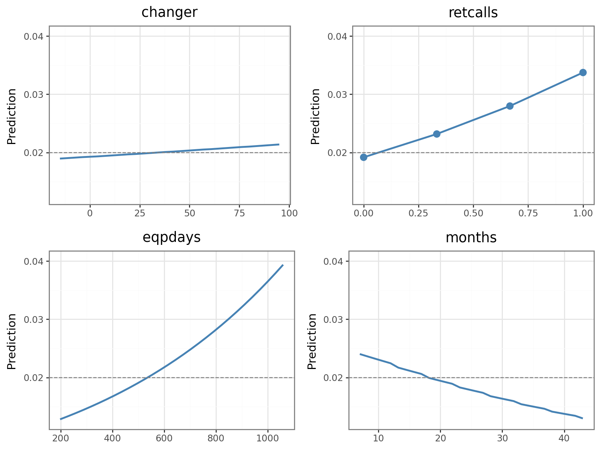
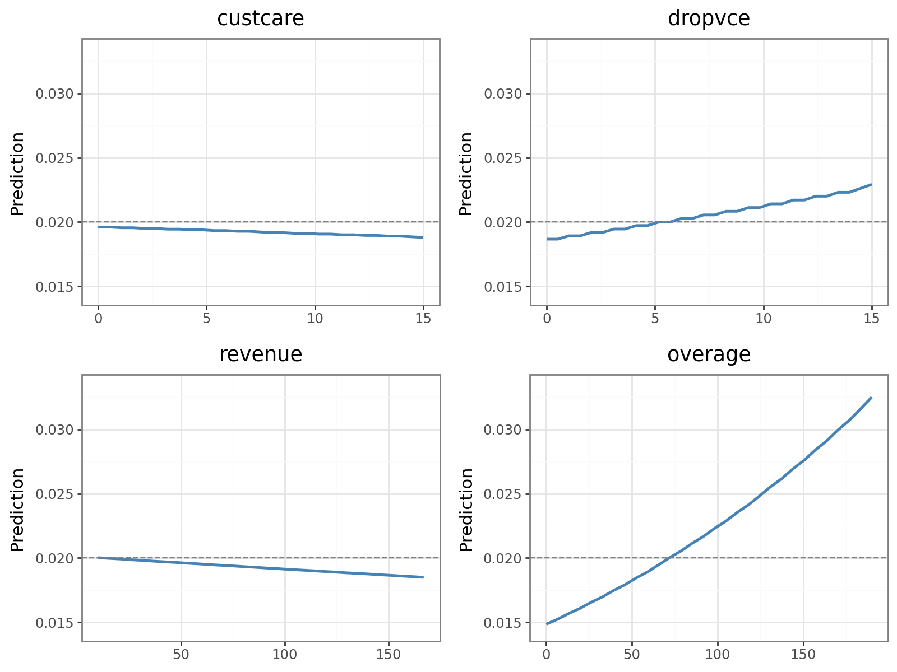

## The Business Problem

S-Mobile, a Singapore telecom with 1 million subscribers, was losing **2% of its base every month**, a rate that compounds into millions in lost recurring revenue a year. The company didn't just need to know *who* would churn; it needed to know which interventions were actually worth paying for.

## What I Built

I trained a churn model on a 27,300-customer sample, using a 50% oversampling scheme with case weights (1:49) so predictions stayed calibrated to the real-world 2% churn rate. A weighted **logistic regression** (AUC 0.688) and a **Random Forest** (AUC 0.726) agreed closely on which customers were most at risk, which gave me confidence the drivers below were real signal rather than noise.

## What Actually Drives Churn

Permutation importance on the full feature set surfaced four factors that matter far more than the rest: job/occupation type, equipment age, overage minutes, and credit standing.

{fig-alt="Bar chart of permutation importance showing occupation, equipment age (eqpdays), overage, and high credit rating as the top churn drivers"}

Partial dependence plots then showed *how* each driver moves risk. Customers with older handsets, heavier overage charges, and repeated customer-service contacts churn at meaningfully higher rates, together touching **over 30% of the subscriber base**:

::: {layout-ncol=2}
{fig-alt="Partial dependence plots for equipment age and overage minutes"}

{fig-alt="Partial dependence plots for customer care contacts and retention calls"}
:::

## Turning Drivers Into Costed Programs: the Dollar Impact

A driver is only useful if it changes what the business does next. I designed three retention interventions and ran each through a **60-month CLV and breakeven model** (40% margin, 7.44% annual discount rate), scaled to the full 1M-subscriber base:

| Program | Target driver | Net impact (5-yr, full base) | Verdict |
|---|---|---|---|
| **Plan-upgrade outreach** | Overage minutes | **+$93M** | Fund it |
| **Handset upgrade subsidy** | Equipment age | **+$12M** | Fund it |
| Refurbished-phone replacement | Refurbished handsets | Net-negative | Cut it |

That third result is the point of doing the math at all. The refurb-replacement idea *sounded* reasonable, but the subsidy cost more than the churn it prevented. Running the CLV numbers before committing budget kept S-Mobile from funding a program that would have lost money.

## Skills Used

`Random Forest` · `Logistic Regression` · `CLV & Breakeven Analysis` · `Python` · `Permutation Importance` · `Partial Dependence Plots`
