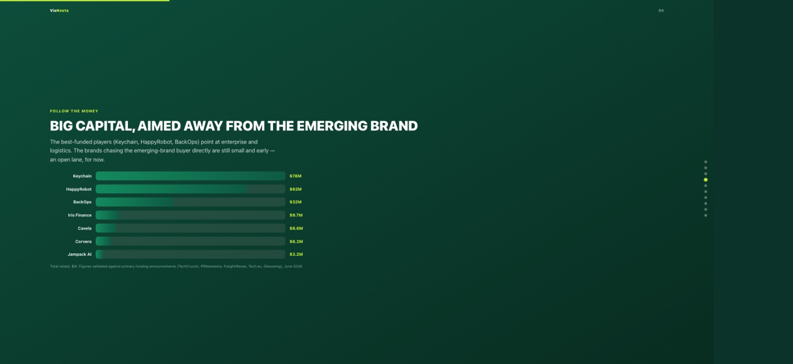

## Problem

ViaNexta, an early-stage CPG supply-chain startup I do business development and analytics work for, needed a clear read on its competitive landscape: who else is building for the same buyer, how well-funded they are, and where the actual white space is. Doing that by hand every time it's needed is slow and it goes stale the moment a competitor raises a new round.

## Approach

Built a Python pipeline that scans public sources — funding announcements, press coverage, and market research (TechCrunch, PRNewswire, Tech.eu, CB Insights, McKinsey, BCG) — on a recurring cadence, cross-checks every figure against a primary source before it's used, and structures the findings into the three views a strategy team would normally build by hand: a positioning matrix, a funding comparison, and a competitive-overlap table. A report generator then renders that structured data straight into an interactive, scroll-snap dashboard, so refreshing the analysis doesn't mean rebuilding slides from scratch.

**[Open the interactive dashboard ↗](deck.html){target="_blank"}**

{fig-alt="Bubble chart plotting competitors by enterprise-vs-emerging-brand focus and point-solution-vs-end-to-end scope, with ViaNexta positioned in the open top-right quadrant"}

## Key Insights

- Mapping competitors on two axes (who they serve, how much of the journey they cover) made the white space visible at a glance instead of buried in a table — the kind of view that's obvious once you see it and easy to miss without it.
- Cross-checking every funding figure against a primary source before publishing it matters: it's the difference between a competitive analysis someone can act on and a hallucinated one.

{fig-alt="Horizontal bar chart comparing total funding raised across seven competitor companies, ranging from $3.2M to $78M"}

## Impact

- Turned a manual, point-in-time competitive research exercise into a pipeline that can be re-run on demand as new funding rounds and market signals land, instead of going stale after one presentation.
- Gives a non-technical founder a self-contained, no-dependencies HTML artifact he can open, scroll through, or print to PDF without any software beyond a browser.

## Tools & Skills

`Python` · `Automated Web Research` · `Data Validation & Source-Checking` · `Competitive Positioning Analysis` · `HTML/CSS/JS Report Generation` · `Business Strategy Communication`
