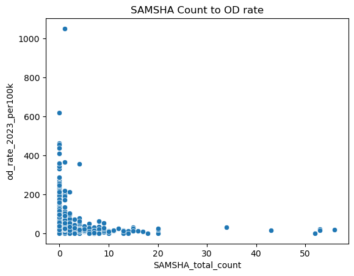

## Problem

A two-person capstone asking: does proximity to SAMHSA-affiliated substance-abuse treatment facilities weaken the relationship between low county income and opioid overdose deaths? We built the analysis from scratch — merging CDC overdose surveillance, SAMHSA facility locations, and county-level income and unemployment data, none of which arrive pre-joined.

**My role:** the regression modeling and visualization — specifying and interpreting the negative binomial models below, including the income-stratified and clinic-access specifications.

**[Explore the team's interactive site ↗](deck.html){target="_blank"}** (Tableau dashboards + the team's shared regression writeup)

## Approach

Merged CDC drug-overdose counts, SAMHSA facility locations, and county income/unemployment data on FIPS codes into a single panel of 3,081 U.S. counties (2023). Overdose counts are a skewed count outcome, so I modeled them with a **negative binomial GLM** (population offset) rather than OLS, and converted every coefficient to an **incidence rate ratio (IRR)** with 95% confidence intervals so the results read in plain terms — "X% more/less overdose risk" — instead of raw log-coefficients.

{fig-alt="Scatterplot of county overdose rate per 100,000 residents against median household income, colored by above- versus below-median income group, showing overdose rate declining as income rises"}

## Key Insights

- **Income is the strongest driver.** Every $10,000 increase in median household income is associated with roughly **12% lower** overdose incidence, holding unemployment, opioid dispensing, and clinic access constant (IRR = 0.9999866 per dollar, p < .001).
- **Unemployment moves the other way.** Each 1-point increase in the unemployment rate is associated with about **8.2% higher** overdose incidence (IRR = 1.082, p < .001).
- **Below-median-income counties carry 37% higher overdose risk** than above-median counties in a simplified model isolating that gap (IRR = 1.374, p < .001) — the clearest single number in the analysis.
- **Clinic density is not protective in this cross-section — and that's the honest, harder-to-report finding.** Counties with more SAMHSA-affiliated clinics per capita showed a small but statistically significant *increase* in overdose incidence (IRR = 1.006, p = .003), and a binary "has clinic access" indicator showed a non-significant effect (p = .18).

{fig-alt="Scatterplot of SAMHSA clinic count per county against overdose rate per 100,000 residents, showing the highest overdose rates concentrated among counties with very few clinics"}

That last result is easy to misread as "clinics don't work." The more defensible read: this is a single cross-section, and counties experiencing a worse crisis are precisely the ones installing more clinics in response. A static regression can't separate "clinics fail to help" from "clinics get built where the fire is already burning" — that needs panel data tracking counties before and after a clinic opens, which we flagged as the direct next step.

## Tools & Skills

`Python` · `statsmodels (GLM, Negative Binomial)` · `Multi-Source Data Merging (FIPS)` · `Incidence Rate Ratios` · `Tableau` · `Public Health Data Interpretation`
