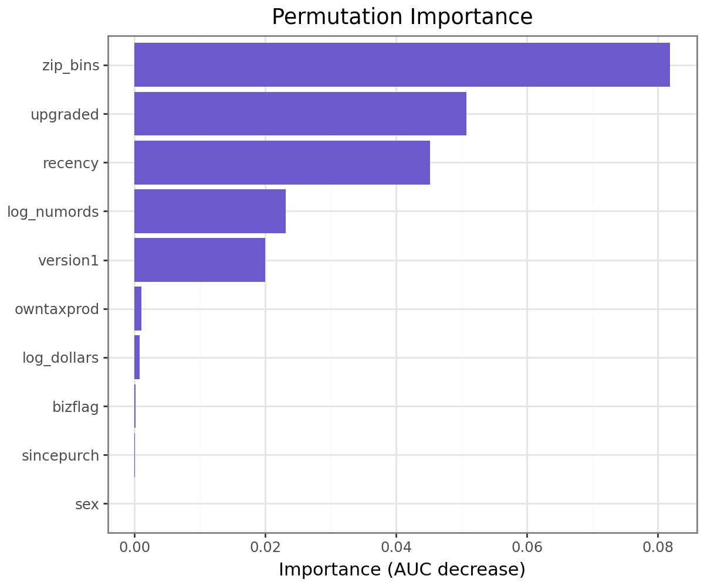

## Problem

A classic direct-mail scenario: after a first-wave mailing promoting a product upgrade, non-responders are candidates for a second wave. Mailing everyone wastes money on people who were never going to respond; mailing no one leaves real profit on the table. The question is who, among the non-responders, is actually worth a second mailing. This was a 3-person team project (with Ruijie Ma and Wanying Hu) built to answer exactly that with a real response dataset.

## Approach

Started with RFM-style exploratory analysis (recency, frequency, monetary value, and geography) before modeling anything. One pattern stood out immediately:

{fig-alt="Bar chart of response rate by ZIP code bin, with bin 1 spiking to about 22% against a 4.8% average across the other 19 bins"}

Built a logistic regression on the full variable set, checked it against a permutation-importance plot, then **refined it by removing three variables** (customer tenure, business-name flag, gender) whose p-values were all above 0.45: noise, not signal, both statistically and on business logic (how long someone's been a customer doesn't predict whether this specific offer lands).

{fig-alt="Horizontal bar chart of permutation importance for the logistic regression model, with zip_bins, upgraded, and recency as the top three predictors and sincepurch and sex contributing almost nothing"}

The refined model (`logit2`) hit an AUC of 0.754. We then built a two-hidden-layer neural network (16 and 8 neurons, ReLU) on the same variables to see whether a non-linear model would find signal the logistic regression missed. It did: AUC 0.823, a real 7-point gain.

## Key Insights

- **We picked the worse-scoring model on purpose.** The neural network's extra accuracy came at the cost of 625 uninterpretable weights versus logit2's 26 coefficients that read directly as odds ratios ("customers in ZIP bin 1 are over 5x more likely to upgrade than the reference bin, holding recency and frequency constant"). For a mailing decision the business needs to explain and audit, that trade was worth more than 7 points of AUC.
- Turning the model into a mail/no-mail rule required one more step beyond AUC: computing the **breakeven response probability** from the campaign's own cost and margin structure, then mailing only customers scoring above it. The model doesn't decide who to mail, the economics do.

## Impact

- Applying the `logit2` breakeven rule (mail if predicted response probability ≥ 0.0235) to the 763,334 eligible non-responders selects **239,483 customers** (about a third of the list) projected to deliver **$369,808 in profit**, a **35x improvement** over mailing the full list untargeted.
- The takeaway that traveled best in this project was the discipline of picking a model the business could actually act on and defend, not the one with the best leaderboard score.

## Tools & Skills

`Python` · `Logistic Regression` · `Neural Networks (MLP)` · `Permutation Importance` · `RFM Analysis` · `Breakeven / Expected-Profit Targeting` · `Model Selection Trade-offs`
