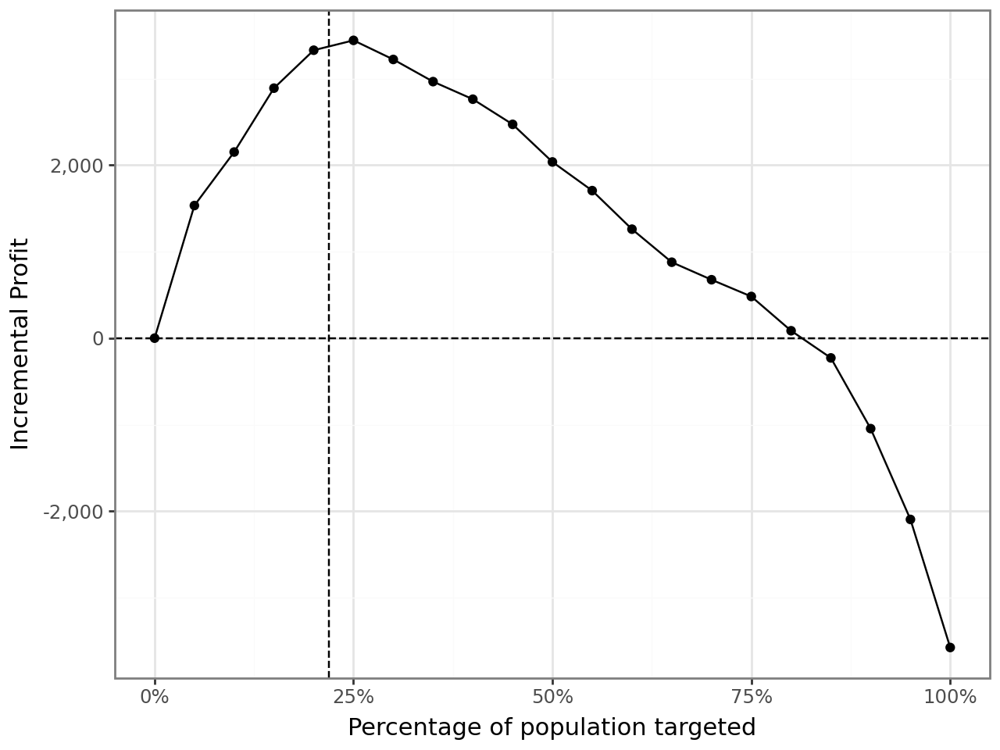
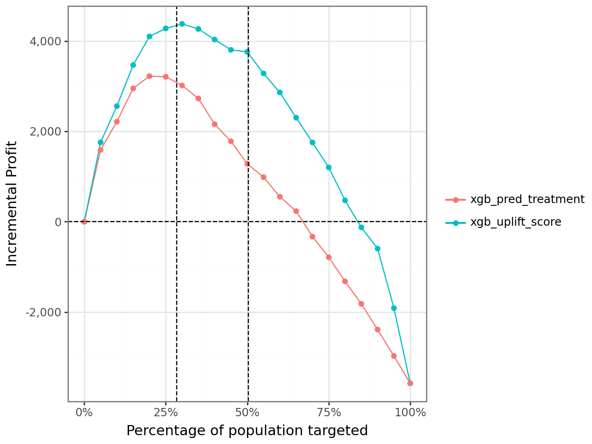

## The Business Problem

A standard marketing model asks "who is most likely to respond?" That includes customers who would have bought anyway. The more useful question is "who will respond **because of** the campaign?" Sending an offer to someone who was buying regardless just gives away margin. This project compares both approaches on the same customer base to see how much profit is actually left on the table by targeting on response propensity instead of incremental impact.

## Approach

I built a standard **propensity model** (predicts response probability directly) as the baseline, then built **uplift models**, trained to predict the *difference* in response between treated and untreated customers, across three algorithms: Neural Network, Random Forest, and XGBoost. For each model, I ranked customers by their score and simulated incremental profit at every targeting depth from 0% to 100% of the population.

## The Targeting Curve

Every model produces the same shape: incremental profit rises as you target more of the highest-scored customers, peaks at some optimal targeting depth, then turns negative as you start paying to reach customers who wouldn't have converted anyway.

{fig-alt="Line chart of incremental profit versus percentage of population targeted, peaking around 20-25%"}

## Propensity vs. Uplift, Head to Head

The real test is comparing a propensity-based targeting rule against an uplift-based one on the same population. Using XGBoost for both, the uplift score identifies a **higher and later-peaking profit curve**, and keeps finding incrementally profitable customers well past the point where the plain propensity model turns negative:

{fig-alt="Line chart comparing incremental profit curves for XGBoost propensity-based targeting versus uplift-score-based targeting, with uplift score outperforming"}

## Why It Matters

The gap between the two curves *is* the money a propensity-only targeting strategy either leaves on the table or overspends chasing customers who were never incremental in the first place. For a marketing or growth analytics role, that gap is the difference between "who looks like a buyer" and "who our spend actually moves." The second question is the one that protects budget.

## Skills Used

`Uplift Modeling` · `XGBoost` · `Random Forest` · `Neural Networks` · `Incrementality Testing` · `Python`
