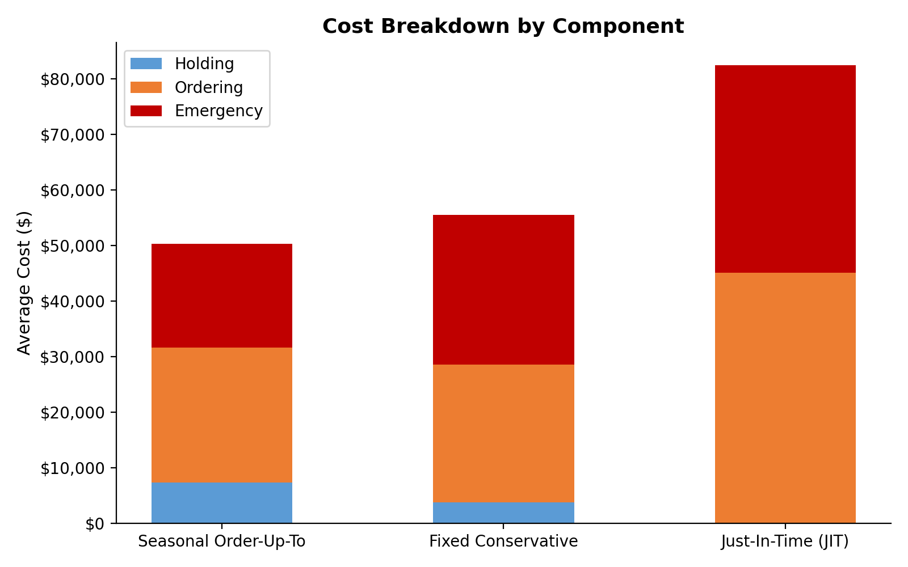
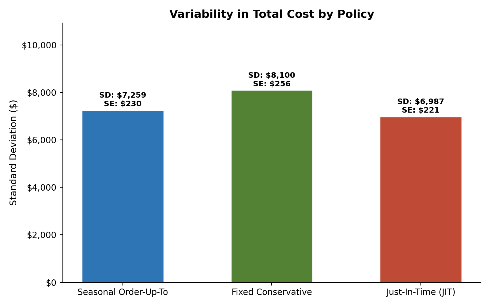
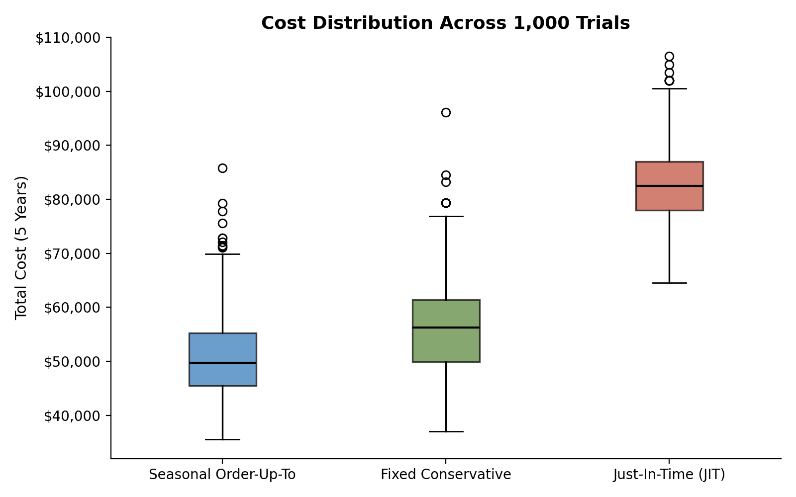

## The Business Problem

Last-mile medication delivery can't run out of stock, but holding too much inventory is expensive too. The real challenge is deciding how to order when resupply routes themselves are unreliable — and unreliability varies by season. I modeled this as a policy-comparison problem: given the same disruption risk, which ordering rule costs the least over time?

## Approach

I built a **Monte Carlo simulation** — 1,000 independent trials over a 5-year (60-month) horizon — with a two-state Markov model governing whether resupply routes were "on" or "off" in a given month, with season-dependent transition probabilities. Against that disruption model, I compared three ordering policies:

- **Seasonal Order-Up-To** (my design) — adapts order quantity to the season's disruption risk
- **Fixed Conservative** — a flat, always-cautious order-up-to level
- **Just-In-Time (JIT)** — lean ordering, minimal buffer stock

## Result: the Adaptive Policy Wins on Total Cost

Across all 1,000 trials, the seasonally adaptive policy produced the lowest average total cost — about **$10,131 per location per year** cheaper than the fixed conservative benchmark, and far cheaper than JIT:

{fig-alt="Bar chart showing average total cost over 5 years: Seasonal Order-Up-To $50,653, Fixed Conservative $56,297, Just-In-Time $82,462"}

## Where the Savings Actually Come From

Breaking total cost into its components shows the trade-off clearly: the adaptive policy accepts modestly higher **holding cost** in exchange for a much larger cut in expensive **emergency deliveries** — every extra dollar spent on holding inventory saved roughly $2.33 in avoided emergency shipments.

{fig-alt="Stacked bar chart breaking down total cost into holding, ordering, and emergency components for each policy"}

The adaptive policy is also the most **predictable** one — lower cost variability across trials means fewer expensive surprise months, which matters as much to a budget-owner as the average itself:

::: {layout-ncol=2}
{fig-alt="Bar chart of cost variability (standard deviation) by policy"}

{fig-alt="Box plot showing cost distribution across 1,000 trials for each policy"}
:::

## Why It Matters

This is a prioritization decision, not just a simulation exercise: given a fixed budget, which policy do you actually recommend to the business? I ran a full sensitivity analysis on each cost and probability assumption before packaging the result as a management-facing recommendation — the kind of trade-off-driven, quantified case a business or product analytics role is expected to make.

## Skills Used

`Monte Carlo Simulation` · `Markov Chain Modeling` · `Python` · `Sensitivity Analysis` · `Inventory Policy Design`
