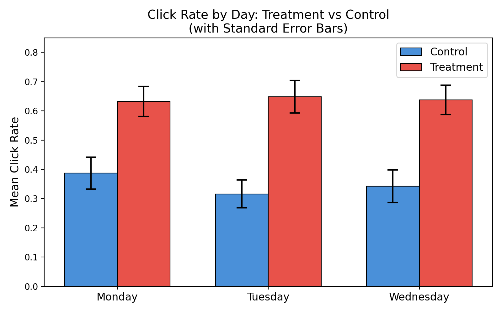

## The Question

Does a landing page redesign actually increase clicks — and is the effect real, or just noise from a lucky sample?

## Design

A randomized control/treatment split, with click behavior measured across both groups and an **OLS regression** used to test statistical significance rather than eyeballing the raw rates.

## Result

Click-through rate moved from **34.7% (control) to 63.9% (treatment)** — a lift large enough to hold up clearly against the standard error bars:

{fig-alt="Bar chart showing mean click rate of 0.347 for control and 0.639 for treatment, with error bars"}

## Checking for Hidden Segments

Before calling it done, I checked whether the lift was uniform or hiding a day-of-week effect that could mislead a rollout decision — some redesigns perform well on weekdays and fall flat on weekends, for example. The lift held consistently across days, which ruled out a scheduling confound:

{fig-alt="Grouped bar chart of click rate by day of week for treatment and control groups"}

## Why It Matters

This is the shape of experiment most business and product analyst roles actually run day-to-day — a clear hypothesis, a randomized test, a regression to confirm the effect isn't noise, and a heterogeneity check before recommending a rollout.

## Skills Used

`A/B Testing` · `OLS Regression` · `Randomized Experiment Design` · `Python`
