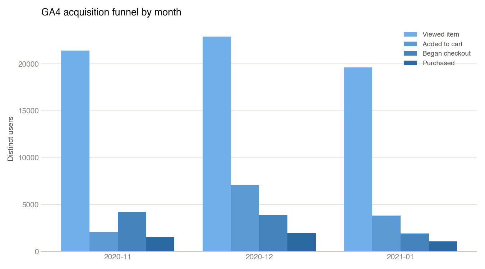

## Why I Built This

Most portfolio pieces are either a pure SQL/dashboard project with no product thinking, or a PM write-up with no data behind it. I wanted one project that did both, and went a step further most stop short of: pressure-test its own headline finding before trusting it, instead of just reporting the first plausible number.

**[View the repo →](https://github.com/Yafei-Judie/pm-portfolio-ecommerce-journey)** · **[Live interactive dashboard →](https://claude.ai/code/artifact/4b343ae2-f31e-4c63-ae51-77ef521a5498)**

## The Data

Two real public datasets, no invented numbers: Google's **GA4 e-commerce sample dataset** (real BigQuery event export from the Google Merchandise Store) for acquisition and funnel analysis, and the **Olist Brazilian E-Commerce dataset** (~100K real orders, 2016 to 2018, from Kaggle) for delivery and post-purchase analysis.

{fig-alt="Acquisition and on-site funnel chart built from GA4 e-commerce sample data"}

## The Headline Finding

Eight SQL queries later, covering delivery lateness by state, seller-customer distance, repeat-purchase rate, and freight economics, one result stood out: a delivery that lands 7+ days late drops the average review score from about 4.3 to 1.70, and pushes the share of 1–2 star reviews from ~9% to 79%. Being early costs almost nothing.

{fig-alt="Bar chart showing average review score dropping from 4.32 for early deliveries to 1.70 for deliveries 7 or more days late"}

## The Finding This Project Almost Missed

Rather than stop there, I ran four independent critiques against the finding: causal inference, business strategy, customer behavior, and measurement quality. The measurement-quality pass caught something real: **97.3% of reviews in the "7+ days late" bucket were submitted before the package even arrived**, because Olist's review survey triggers off the *estimated* delivery date, not the actual one. That doesn't kill the finding, but it changes what the success metric has to compare against. I re-ran every number the critique produced against the live database myself before touching anything downstream, and corrected two that were slightly off.

## From Finding to Product Decision

The corrected finding pointed at a specific, ownable problem: customers aren't proactively told when a delivery is going to miss its window. I scoped a **PRD** for a proactive-delivery-notification feature, sequenced it in a **RICE-prioritized roadmap**, built two clickable prototypes, and wrote a **QA test plan**, including an actual trigger-logic simulator (8/8 test cases passing) that surfaced a real gap: the v1 notification rule never fires for a package that's never scanned even once. That's logged as an open defect in the PRD instead of being quietly patched.

## A Second Module: Churn & CLV

The same repo includes a separate data-analyst module on a third dataset (UCI Online Retail II: 1,067,371 raw invoice lines, cleaned to 796,622 rows across 5,840 customers) to cover ground the SQL/PM module doesn't: **RFM segmentation**, a **churn classification model** (logistic regression AUC 0.787, random forest AUC 0.797, close enough that the interpretable model is the one worth handing to a stakeholder), and **probabilistic CLV** via BG/NBD and Gamma-Gamma.

::: {layout-ncol=2}
{fig-alt="RFM segmentation chart showing customer segments by recency, frequency, and monetary value"}

{fig-alt="Scatter plot quadrant chart identifying high-value, high-churn-risk customers to prioritize for retention"}
:::

Combining churn risk and predicted value: **326 customers carry £565,689 of projected 12-month value and above-median churn risk**, the specific group a retention effort should target first. The cleaning step caught a real bug along the way: one 80,995-unit order, placed and cancelled 12 minutes later, was still being counted as revenue under the standard "drop cancelled invoices" approach. That one order alone had inflated one segment's average predicted CLV by roughly 4x before a proper order-matcher caught it.

## Why It Matters

The self-correction is the part that actually differentiates this from a standard SQL-plus-Kaggle-dataset project: I found my own critique's errors and fixed them before they went into the PRD, instead of shipping the first plausible answer. That's the same discipline a real PM or analyst role expects: the finding isn't done until it survives someone actively trying to break it.

## Skills Used

`SQL` · `BigQuery` · `Python` · `RFM Segmentation` · `Logistic Regression` · `Random Forest` · `BG/NBD & Gamma-Gamma CLV` · `PRD Writing` · `RICE Prioritization` · `QA Test Design`
