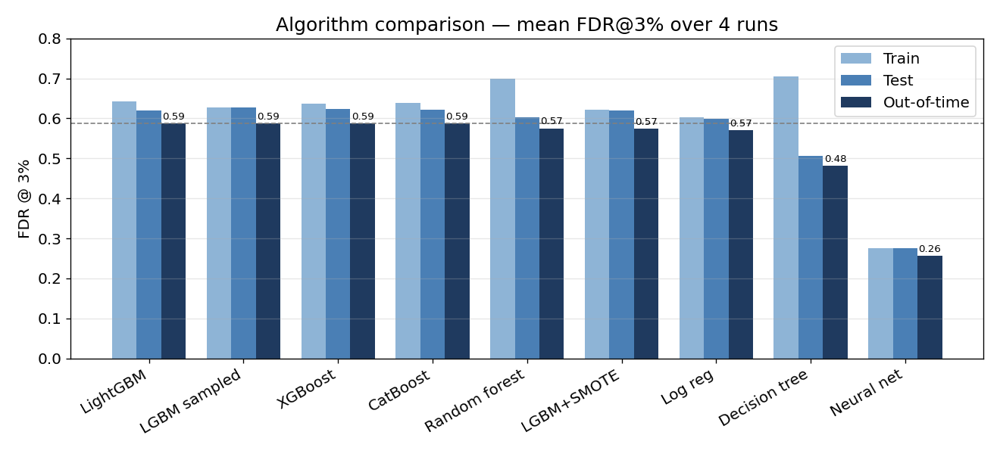
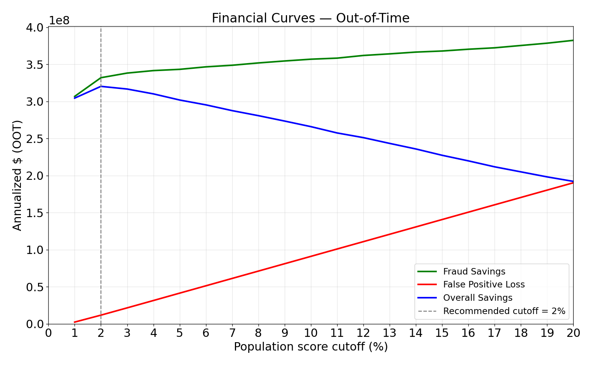

## Problem

A lender processing a million loan and cell-phone applications a year, with a small fraud team, can't manually review every application. Fraudsters use stolen or synthetic identities to open accounts and then default or disappear, leaving the issuer to absorb the loss. The team needed a way to rank applications by risk so limited review capacity gets pointed at the small slice most likely to be fraudulent.

## Approach

Started from 1,000,000 application records (2017, 1.44% fraud rate) with just 10 raw fields: SSN, name, address, phone, date of birth. Before any modeling, the data quality review surfaced something specific to fraud data: identity fields double as *linking keys* that connect applications to the same person, and several fields were full of frivolous placeholder values that would have manufactured false connections.

{fig-alt="Bar chart showing the SSN value 999999999 appearing over 16,000 times versus near-zero counts for every other SSN"}

The same pattern showed up in home phone (`9999999999`, 78,512 times), address (`123 MAIN ST`, 1,079 times), and date of birth (a default `06/26/1907`). Left alone, the model would have treated tens of thousands of unrelated applications as one person and invented enormous, false velocity signals. Each placeholder was replaced with a unique, non-linking value so it could only ever link to itself.

From the cleaned data, engineered **1,841 candidate variables** across six families (velocity counts, relative velocity, cross-entity uniqueness counts, max indicators, age indicators, day-of-week risk), all built to measure how fast and how inconsistently an identity gets reused across applications. A two-stage selection process (a KS-statistic univariate filter, then a LightGBM forward-stepwise wrapper) narrowed that down to the 10 strongest predictors, which turned out to be dominated by **address-based velocity**: a physical address is one of the hardest things for a fraudster to vary, so a burst of applications from the same address is the strongest signal a fraud ring is operating from one location.

Eight algorithms were compared on FDR@3% (fraction of fraud caught while reviewing the riskiest 3% of applications), each run four times with fresh train/test splits and validated out-of-time on two held-out months:

{fig-alt="Bar chart comparing FDR at 3% across nine model configurations on train, test, and out-of-time sets"}

## Key Insights

- **LightGBM won on generalization, not just raw accuracy**: 64.2% FDR on training, 62.0% on test, 59.1% out-of-time. The small train-to-out-of-time gap is what mattered: a single decision tree hit 70.5% on training but collapsed to 48.1% out-of-time, the classic overfitting failure a portfolio-worthy model has to avoid.
- Rebalancing techniques (SMOTE, downsampling) didn't beat plain LightGBM on the out-of-time set. The added complexity wasn't worth it.
- Every field was 100% populated, which looked like clean data until the placeholder-value check: a reminder that "no missing values" isn't the same as "no data quality problem" in fraud work.

## Impact

Translated the model's ranking into dollars: $4,000 saved per fraud caught, $100 lost per false positive, scaled to a full year of the 10-million-application population.

{fig-alt="Line chart showing fraud savings, false positive loss, and overall net savings against review cutoff percentage, with net savings peaking around $320 million"}

- **Recommended cutoff: review the riskiest 3% of applications.** It sits on the flat top of the savings curve, gives up less than 1% of the theoretical maximum, and catches more fraud (59% vs. 58%) than the marginally-higher-savings 2% cutoff.
- Projected **~$317M/year in net savings** at that cutoff (peaking near $320M at 2%). The fraud team can find roughly three out of five frauds while reviewing three out of every hundred applications.

## Tools & Skills

`Python` · `LightGBM / XGBoost / CatBoost` · `Feature Engineering at Scale` · `KS-Statistic Feature Selection` · `Imbalanced Classification` · `Out-of-Time Validation` · `Financial ROI Modeling`
